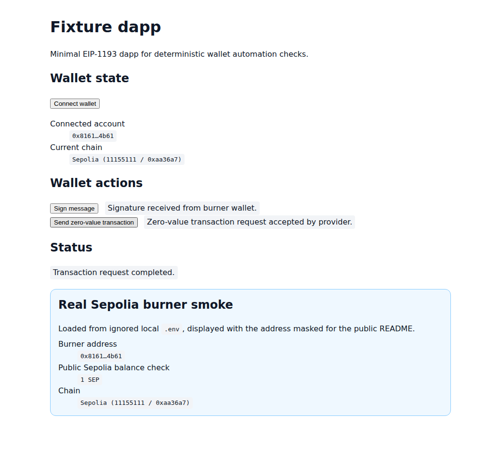

# agent-browser-wallet

Make LLM-agent browser environments dapp-capable by provisioning a real browser wallet extension profile.

This repo is focused on one concrete path: **Playwright/Chromium + pinned MetaMask extension + isolated burner Sepolia profile + reusable wallet automation helpers**.

## Fixture dapp in action

The committed screenshots below are captured with Playwright from the local fixture dapp and a deterministic mocked EIP-1193 provider. They do not use real wallet secrets, private keys, RPC tokens, or browser profiles.

<p align="center">
  
</p>

<p align="center">
  
</p>

<p align="center">
  
</p>

The public-safe mocked-provider screenshots regenerate with:

```bash
pnpm docs:assets
```

This repo also includes a screenshot captured from the ignored local Sepolia burner configuration. The generator reads `SEPOLIA_WALLET_ADDRESS` from `.env`, checks its Sepolia balance over a public RPC endpoint, masks the address in the page, and captures the fixture flow without committing wallet secrets.

<p align="center">
  
</p>

Regenerate the local real-burner screenshot with:

```bash
pnpm docs:assets:real-sepolia
```

## What works now

- Resolve and validate an unpacked MetaMask extension path for persistent Chromium launch.
- Build launch plans for Playwright-managed Chromium with isolated wallet profiles.
- Validate/redact MetaMask onboarding inputs for a Sepolia burner wallet.
- Assert Sepolia/local-devnet chain and configured burner account state.
- Run a tiny fixture dapp with stable `data-testid` selectors.
- Exercise connect/sign/send flows with mocked-provider Playwright tests.
- Use wallet-control helpers for `connectWallet`, `approveSignature`, `approveTransaction`, `switchNetwork`, `assertWalletState`, and `resetProfile`.
- Enforce audit/safety guardrails for origin, chain, account, target, and transaction value.

## Try it

```bash
pnpm install --frozen-lockfile
pnpm test
pnpm typecheck
pnpm build
pnpm fixture:test:mocked-provider
```

Serve the fixture locally:

```bash
pnpm fixture:build
pnpm fixture:serve
```

Then open `http://127.0.0.1:5173`.

Inspect sanitized wallet-browser plans:

```bash
pnpm --filter @agent-browser-wallet/wallet-browser cli --help
pnpm --filter @agent-browser-wallet/wallet-browser cli prepare
pnpm --filter @agent-browser-wallet/wallet-browser cli onboarding-plan
pnpm --filter @agent-browser-wallet/wallet-browser cli network-plan
```

## Near-term MVP

1. Launch Playwright-managed Chromium with a pinned MetaMask extension in a persistent, isolated profile.
2. Import a supplied burner Sepolia wallet from local secrets.
3. Assert the active address and chain before any wallet action.
4. Validate connect/sign/send flows against a tiny fixture dapp.
5. Reuse the same helper surface against `wildcat-app-v2` on Sepolia after the fixture flow is reliable.

## Safety posture

- Use only burner/local/testnet wallets.
- Keep wallet material in local `.env` files that are ignored by Git; start from [.env.example](.env.example).
- Follow [security and artifact handling](docs/security-and-artifacts.md) for local profiles, traces, screenshots, reports, and CI uploads.
- Never commit private keys, seed phrases, RPC tokens, wallet passwords, extension profile directories, traces, screenshots, or test artifacts containing secrets.
- Fail closed on unexpected chain, account, value, contract, dapp origin, or wallet prompt state.
- Treat the MetaMask profile as sensitive even when it only contains testnet funds.

## Docs

See [Phase 1 runtime matrix](docs/phase-1-runtime-matrix.md), [Phase 1 completion status](docs/phase-1-completion.md), [security and artifact handling](docs/security-and-artifacts.md), [Phase 2 handoff checklist](docs/phase-2-handoff.md), [Phase 2 usage and acceptance](docs/phase-2-usage.md), [Phase 3 MetaMask onboarding usage](docs/phase-3-usage.md), [Phase 4 Sepolia network provisioning usage](docs/phase-4-usage.md), [Phase 5 fixture dapp usage](docs/phase-5-usage.md), [Phase 6 wallet-control helper usage](docs/phase-6-usage.md), [Phase 7 audit and safety guardrails](docs/phase-7-usage.md), and [high-level goals](docs/high-level-goals.md).
