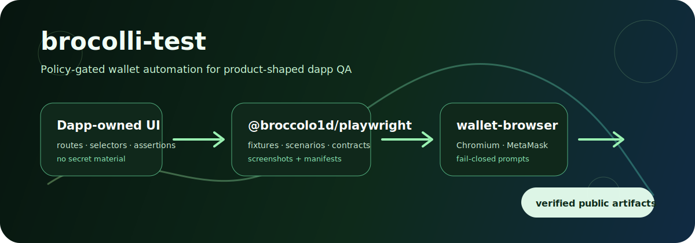

<p align="center">
  
</p>

<h1 align="center">brocolli-test</h1>

<p align="center">
  <strong>Policy-gated wallet automation for product-shaped dapp QA.</strong><br />
  Browser-wallet runtime helpers plus Playwright fixtures for downstream apps such as Broccoli Control and Wildcat.
</p>

<p align="center">
  <a href="https://github.com/BROCCOLO1D/brocolli-test"></a>
  
  
  
  
</p>

---

## At a glance

`brocolli-test` is a two-package workspace for wallet-backed dapp QA. It packages the browser-wallet runtime and the Playwright fixtures used by downstream apps.

```text
@broccolo1d/playwright
  └─ imports @broccolo1d/wallet-browser
       └─ uses Playwright Chromium persistent contexts
            └─ loads an unpacked MetaMask extension from ignored local storage
```

## What it gives a dapp team

- **Policy-gated wallet actions** for connect, chain checks, and signatures.
- **Deterministic scenarios** through `walletScenario()` / `installWalletScenario()` for disconnected, connected, wrong-chain, rejected/pending method, and optional EIP-6963 discovery smoke coverage.
- **Reusable contract rows** from `@broccolo1d/playwright/contracts` that keep selectors app-owned while writing screenshot + manifest + artifact-index evidence.
- **Optional real-wallet flows** for private-key-backed MetaMask local/testnet proof capture.
- **Reviewable evidence** with public-safe proof manifests, screenshots, and artifact indexes.
- **Fail-closed guardrails** so unknown prompts are not clicked by default.

## Packages

| Package | Version | Purpose |
| --- | ---: | --- |
| [`@broccolo1d/wallet-browser`](packages/wallet-browser/README.md) | `0.2.9` | Core browser automation for MetaMask integration with Chromium context management and wallet state verification. |
| [`@broccolo1d/playwright`](packages/playwright/README.md) | `0.2.10` | Playwright test fixtures, deterministic wallet scenarios, reusable dapp contract rows, and structured proof artifacts. |

## Quick example

```ts
import { expect, test, verifyWalletQaProofManifest } from '@broccolo1d/playwright';

test('wallet connects on Sepolia', async ({ page, wallet, walletArtifacts }) => {
  await page.goto('http://127.0.0.1:5173');

  const result = await wallet.connect({
    click: async () => page.getByRole('button', { name: /connect/i }).click()
  });

  await wallet.expectConnected();
  await wallet.expectChain({ expectedChainId: 11155111 });

  const screenshot = await walletArtifacts.screenshot('connected');
  await walletArtifacts.connectedProof('wallet-connected', {
    origin: 'http://127.0.0.1:5173',
    account: result.activeAccount,
    chainId: result.chainId,
    attachments: [{ label: 'dapp-connected', path: screenshot, contentType: 'image/png' }]
  });

  await verifyWalletQaProofManifest(walletArtifacts.artifactDir, 'wallet-connected.json');
  await walletArtifacts.writeArtifactIndex({ manifestNames: ['wallet-connected.json'] });
  await expect(page.getByText(/connected/i)).toBeVisible();
});
```

## Runtime model

1. A test or CLI command resolves configuration.
2. Chromium launches with a persistent profile and an unpacked extension only when explicitly requested.
3. Dapp code triggers wallet actions through app-owned UI drivers.
4. Wallet prompt drivers validate expected prompt text and policy before clicking.
5. Network drivers assert account and chain state.
6. Artifacts are written under ignored local directories and verified before sharing.

## Install in a dapp test repo

Most consumer repos should start with the Playwright package:

```bash
pnpm add -D @broccolo1d/playwright @playwright/test
```

Use the lower-level browser package directly when building custom runners or non-fixture integrations:

```bash
pnpm add -D @broccolo1d/wallet-browser playwright
```

Both packages are ESM-only and require Node.js `>=22 <23`.

## Playwright configuration

```ts
// playwright.config.ts
import {
  createFailClosedWalletPromptDriver,
  defineWalletQaConfig,
  type MetaMaskNetworkDriver,
  type WalletPromptDriver
} from '@broccolo1d/playwright';

const expectedAccount = process.env.SEPOLIA_WALLET_ADDRESS;
if (!expectedAccount) throw new Error('SEPOLIA_WALLET_ADDRESS is required for wallet QA');

const origin = 'http://127.0.0.1:5173';

const promptAutomation: WalletPromptDriver = {
  async approveConnection() {
    throw new Error('configure app-specific prompt automation before enabling real wallet approval');
  },
  async approveSignature() {
    throw new Error('configure app-specific prompt automation before enabling real signature approval');
  }
};

const prompt = createFailClosedWalletPromptDriver({
  origin,
  expectedAccount,
  expectedChainIdHex: '0xaa36a7',
  delegate: promptAutomation
});

const network: MetaMaskNetworkDriver = {
  async getChainId() { return 11155111; },
  async getAccounts() { return [expectedAccount]; },
  async switchChain() {},
  async addEthereumChain() {}
};

export default defineWalletQaConfig({
  use: {
    walletConfig: {
      useRealWallet: false,
      artifactDir: '.wallet-artifacts/playwright',
      expectedAccount,
      expectedChainId: 11155111,
      origin,
      prompt,
      network
    }
  }
});
```

`useRealWallet` defaults to `false`. When enabled, `wallet.connect`, `wallet.switchChain`, `wallet.signMessage`, and `wallet.signTypedData` still require explicit expected account/chain inputs and configured dapp, prompt, and network drivers. Signature helpers require the expected origin and message/canonical typed-data JSON before they trigger the dapp request or approve a MetaMask prompt. Transaction approval remains intentionally absent until a zero-value or capped-testnet policy is implemented and tested.

## Wildcat reference workflow

Wildcat is the product-shaped reference for the package surface: a real Next.js dapp, Sepolia target wiring, app-shell smoke tests, optional private-key-backed MetaMask proof capture, and reviewed README screenshots.

### CI-safe Wildcat smoke

Use this shape when a production dapp needs app-shell coverage without loading private wallet material. It verifies that `/lender` renders on Sepolia, avoids locale middleware loops, exposes a connect affordance, and writes baseline artifacts.

```bash
NEXT_PUBLIC_TARGET_NETWORK=Sepolia \
NEXT_RPC_URL=https://eth-sepolia.g.alchemy.com/v2/test-alchemy-key \
NEXT_PUBLIC_API_URL=https://api.wildcat.finance \
NEXT_PUBLIC_TOKENS_LIST_URL=https://tokens.1inch.eth.link \
NEXT_PUBLIC_TOKENS_IMG_HOSTNAME=tokens.1inch.io \
WILDCAT_WALLET_QA_RUN_APP=1 \
npm run test:wallet -- --grep "loads local lender shell"
```

### Connected-wallet Wildcat proof

Connected-wallet evidence is intentionally stricter. It must use a private-key-env-var backed Sepolia test wallet / MetaMask flow from ignored local config or CI secrets. Public-address-only injected-wallet screenshots are not positive evidence for Wildcat.

```bash
chmod 600 .env
set -a && . ./.env && set +a
NEXT_PUBLIC_TARGET_NETWORK=Sepolia npm run test:wallet:real-metamask
```

A publishable Wildcat proof should promote only reviewed files into stable docs paths, for example:

```text
docs/screenshots/wildcat-connected-sepolia-test-wallet.png
docs/screenshots/wildcat-connected-sepolia-test-wallet-proof.json
```

The screenshot should show the local Wildcat app with a connected deterministic Sepolia test wallet and visible network/account UI. No-wallet home pages, connect dialogs, blank pages, public-address-only injected-provider state, and raw `.wallet-artifacts` output are not acceptable as final README evidence.

## Artifact index pattern

After writing one or more proof manifests, write an index so CI and review agents can find public-safe evidence without scraping the whole Playwright output directory:

```ts
await verifyWalletQaProofManifest(walletArtifacts.artifactDir, 'wallet-connected.json');
await walletArtifacts.writeArtifactIndex({
  manifestNames: ['wallet-connected.json'],
  outputName: 'wallet-qa-artifact-index.json'
});
```

The index records manifest digests, masked account/chain/origin summaries, attachment basenames, hashes, and verification status. Upload it with reviewed screenshots and proof manifests; keep traces, raw videos, MetaMask profiles, extension bundles, and `.env` files out of git.

## Lower-level wallet-browser usage

```ts
import {
  assertExpectedChainAndAccount,
  launchWalletBrowser,
  type MetaMaskNetworkDriver,
  resolveSepoliaNetworkConfig,
  resolveWalletBrowserConfig
} from '@broccolo1d/wallet-browser';

const expectedAccount = process.env.SEPOLIA_WALLET_ADDRESS;
if (!expectedAccount) throw new Error('SEPOLIA_WALLET_ADDRESS is required for wallet QA');

const config = resolveWalletBrowserConfig();
const { context } = await launchWalletBrowser({ config });

const network: MetaMaskNetworkDriver = {
  async getChainId() { return 11155111; },
  async getAccounts() { return [expectedAccount]; },
  async switchChain() {},
  async addEthereumChain() {}
};

try {
  await assertExpectedChainAndAccount(resolveSepoliaNetworkConfig({ expectedAccount }), network);
} finally {
  await context.close();
}
```

Prefer package APIs from tests. Use the CLI for local setup, smoke capture, and verification.

## CLI examples

```bash
pnpm wallet:cli --help
pnpm wallet:doctor
pnpm wallet:metamask:fetch --dry-run
pnpm wallet:metamask:fetch
pnpm wallet:prepare
```

`wallet:doctor` prints JSON setup diagnostics for Node, Playwright/Chromium, MetaMask extension artifacts, `.env` key presence, wallet profile paths, and ignored wallet-local directories. It is safe to run before browser setup because it never launches Chromium and never prints private keys, wallet passwords, RPC tokens, or full `.env` contents.

`wallet:prepare` prints a launch plan and does not launch Chromium. The raw local output can include machine-specific paths; keep it local or redact before sharing.

Real browser smoke commands are local-only and should use burner/testnet configuration. On Linux, WSL, or CI without a display, run with Xvfb:

```bash
xvfb-run -a pnpm wallet:smoke:metamask
pnpm wallet:smoke:verify
pnpm wallet:smoke:verify .wallet-artifacts/metamask-smoke/<run-id>
```

## Packaging checks

```bash
pnpm --filter @broccolo1d/wallet-browser pack --dry-run
pnpm --filter @broccolo1d/playwright pack --dry-run
npm run verify:playwright-consumer
npm run verify:playwright-release
```

Tarballs include package README files, the root license, package metadata, and built `dist/` output. `npm run verify:playwright-consumer` builds the Playwright package, packs both workspace packages, installs the tarballs into a temporary ESM TypeScript consumer, and typechecks public imports from both `@broccolo1d/playwright` and `@broccolo1d/playwright/contracts`. It does not use wallet secrets or publish packages.

Run `npm run verify:playwright-release` before adopting a new public release in downstream apps such as Wildcat. It checks that the current `@broccolo1d/playwright@0.2.10` package version is still unpublished on npm and that local npm registry auth is active, without printing tokens or publishing anything. If npm auth fails, refresh an ignored local automation/granular token or use an OTP-backed publish flow before running `npm publish --access public` from `packages/playwright`.

When the readiness check is green and local tests/pack review pass, prefer `npm run publish:playwright` for the actual package publish. The helper uses plain `npm publish` from `packages/playwright` with a token-backed temporary `--userconfig`, loading `NPM_TOKEN` or `NODE_AUTH_TOKEN` from the environment or ignored local `.env`, then removes the temporary npm config after publish. Use `npm run publish:playwright -- --dry-run` for a final no-publish inspection with the same auth path.

## Safety model

See [docs/security-and-artifacts.md](docs/security-and-artifacts.md) for the full handling policy.

- Keep traces, raw videos, MetaMask profiles, extension bundles, `.env` files, and raw `.wallet-artifacts` output out of git.
- Publish only reviewed screenshots, proof manifests, and artifact indexes.
- Prefer deterministic CI smoke first; promote private-key-backed Sepolia evidence only after manual review.

## Docs

- [Architecture](docs/architecture.md)
- [Security and artifact handling](docs/security-and-artifacts.md)
- [Product roadmap](docs/product-roadmap.md)
- [`@broccolo1d/wallet-browser`](packages/wallet-browser/README.md)
- [`@broccolo1d/playwright`](packages/playwright/README.md)
