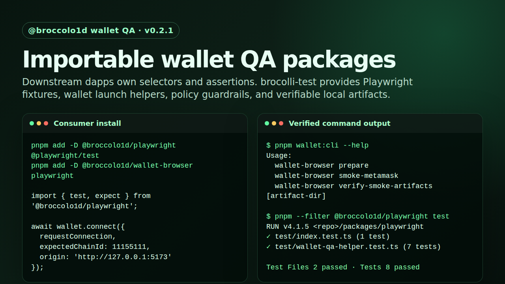

# brocolli-test

Infrastructure-grade Web3 QA packages for Playwright suites that need to exercise dapps through a real browser-wallet path.

`brocolli-test` is code-first test infrastructure, not a collection of target scripts. Downstream apps keep ownership of routes, selectors, test data, and assertions. These packages provide the reusable wallet runtime, Playwright fixtures, policy guardrails, CLI verification, and public-safe artifact contracts.



## Packages

| Package | Version | Purpose |
| --- | ---: | --- |
| [`@broccolo1d/wallet-browser`](packages/wallet-browser/README.md) | `0.2.1` | Lower-level Chromium/MetaMask launch helpers, prompt guardrails, network/account assertions, smoke CLI, and artifact verification. |
| [`@broccolo1d/playwright`](packages/playwright/README.md) | `0.2.1` | Playwright fixtures for app-owned wallet QA specs, proof manifests, screenshots, and fail-closed wallet policy wiring. |

The default posture is conservative:

- real wallet launch is opt-in;
- burner/testnet wallets only;
- prompts fail closed unless explicit drivers and policy are configured;
- signatures and transactions are not approved implicitly;
- local profiles, screenshots, traces, manifests, extension bundles, and env files are sensitive runtime state;
- public output must not contain private keys, seed phrases, RPC credentials, local paths, or full wallet addresses.

## What is implemented

- ESM TypeScript packages published as `@broccolo1d/wallet-browser@0.2.1` and `@broccolo1d/playwright@0.2.1`.
- Persistent Chromium launch with an unpacked MetaMask extension.
- Redacted CLI commands for launch planning, onboarding planning, network planning, smoke capture, and artifact verification.
- Connect-oriented wallet control helpers with account, chain, origin, and prompt guardrails.
- Playwright fixtures for downstream dapp QA specs.
- Public-oriented proof manifests with attachment basename, sha256, size, masked account, safe origin, and redacted failure text.
- Verification helpers that reject full addresses, absolute local paths, and mismatched artifact hashes.
- Repository sensitive-content scan for tracked files and git history.

Not claimed: production-wallet automation, mainnet automation, broad wallet comparison, blind signing, or unrestricted transaction approval.

## Install in a dapp test repo

Most consumer repos should start with the Playwright package:

```bash
pnpm add -D @broccolo1d/playwright @playwright/test
```

Use the lower-level browser package directly when building custom runners or non-fixture integrations:

```bash
pnpm add -D @broccolo1d/wallet-browser playwright
```

Both packages are ESM-only and require Node.js `>=22 <23`.

## Playwright usage

```ts
// playwright.config.ts
import {
  createFailClosedWalletPromptDriver,
  defineWalletQaConfig,
  type MetaMaskNetworkDriver,
  type WalletPromptDriver
} from '@broccolo1d/playwright';

const expectedAccount = process.env.SEPOLIA_WALLET_ADDRESS;
if (!expectedAccount) throw new Error('SEPOLIA_WALLET_ADDRESS is required for wallet QA');

const origin = 'http://127.0.0.1:5173';

// Supply real, reviewed prompt automation in jobs that approve wallet UI.
const promptAutomation: WalletPromptDriver = {
  async approveConnection() {
    throw new Error('configure app-specific prompt automation before enabling real wallet approval');
  }
};

const prompt = createFailClosedWalletPromptDriver({
  origin,
  expectedAccount,
  expectedChainIdHex: '0xaa36a7',
  delegate: promptAutomation
});

const network: MetaMaskNetworkDriver = {
  async getChainId() { return 11155111; },
  async getAccounts() { return [expectedAccount]; },
  async switchChain() {},
  async addEthereumChain() {}
};

export default defineWalletQaConfig({
  use: {
    walletConfig: {
      useRealWallet: false,
      artifactDir: '.wallet-artifacts/playwright',
      expectedAccount,
      expectedChainId: 11155111,
      origin,
      prompt,
      network
    }
  }
});
```

```ts
// tests/wallet.spec.ts
import { expect, test, verifyWalletQaProofManifest } from '@broccolo1d/playwright';

test('connects with explicit wallet policy', async ({ page, wallet, walletArtifacts }) => {
  await page.goto('http://127.0.0.1:5173');

  const result = await wallet.connect({
    requestConnection: async () => page.getByRole('button', { name: /connect/i }).click()
  });

  await wallet.assertState();
  const screenshot = await walletArtifacts.screenshot('connected');

  await walletArtifacts.writeProofManifest({
    status: 'connected',
    origin: 'http://127.0.0.1:5173',
    account: result.activeAccount,
    chainId: result.chainId,
    attachments: [{ label: 'dapp-connected', path: screenshot, contentType: 'image/png' }]
  });

  await verifyWalletQaProofManifest(walletArtifacts.artifactDir);
  await expect(page.getByText(/connected/i)).toBeVisible();
});
```

`useRealWallet` defaults to `false`. When enabled, `wallet.connect` still requires expected account, expected chain, a dapp trigger, `walletConfig.prompt`, and `walletConfig.network`.

## Lower-level wallet-browser usage

```ts
import {
  assertExpectedChainAndAccount,
  launchWalletBrowser,
  type MetaMaskNetworkDriver,
  resolveSepoliaNetworkConfig,
  resolveWalletBrowserConfig
} from '@broccolo1d/wallet-browser';

const expectedAccount = process.env.SEPOLIA_WALLET_ADDRESS;
if (!expectedAccount) throw new Error('SEPOLIA_WALLET_ADDRESS is required for wallet QA');

const config = resolveWalletBrowserConfig();
const { context } = await launchWalletBrowser({ config });

const network: MetaMaskNetworkDriver = {
  async getChainId() { return 11155111; },
  async getAccounts() { return [expectedAccount]; },
  async switchChain() {},
  async addEthereumChain() {}
};

try {
  await assertExpectedChainAndAccount(resolveSepoliaNetworkConfig({ expectedAccount }), network);
} finally {
  await context.close();
}
```

Prefer package APIs from tests. Use the CLI for local setup, smoke capture, and verification.

## Repository development

Requirements:

- Node.js `>=22 <23`
- pnpm `11.0.8`
- Chromium host dependencies required by Playwright for real browser flows

```bash
pnpm install --frozen-lockfile
pnpm test
pnpm typecheck
pnpm build
pnpm security:scan
```

Repository layout:

```text
packages/wallet-browser/           # Core wallet runtime, policy, CLI, and artifact helpers
packages/playwright/                # Playwright fixtures for downstream dapp QA suites
scripts/fetch-metamask-extension.py # Local MetaMask extension fetch utility
scripts/sensitive-scan.py           # Repository sensitive-content scan
docs/architecture.md                # Package boundaries and runtime model
docs/security-and-artifacts.md      # Secret, profile, trace, screenshot, and manifest policy
docs/product-roadmap.md             # Implemented state, roadmap, and non-goals
docs/assets/readme/                 # Public-safe README assets
```

Ignored runtime paths:

```text
.env
.wallet-extensions/
.wallet-profiles/
.wallet-artifacts/
playwright-report/
test-results/
traces/
```

## CLI examples

```bash
pnpm wallet:cli --help
pnpm wallet:metamask:fetch --dry-run
pnpm wallet:metamask:fetch
pnpm wallet:prepare
```

`wallet:prepare` prints a launch plan and does not launch Chromium. The raw local output can include machine-specific paths; keep it local or redact before sharing.

Real browser smoke commands are local-only and should use burner/testnet configuration. On Linux, WSL, or CI without a display, run with Xvfb:

```bash
xvfb-run -a pnpm wallet:smoke:metamask
pnpm wallet:smoke:verify
pnpm wallet:smoke:verify .wallet-artifacts/metamask-smoke/<run-id>
```

## Packaging checks

```bash
pnpm --filter @broccolo1d/wallet-browser pack --dry-run
pnpm --filter @broccolo1d/playwright pack --dry-run
```

Tarballs include package README files, the root license, package metadata, and built `dist/` output.

## Safety model

- Burner/testnet wallets only.
- Real wallet usage is opt-in.
- Unknown prompts fail closed.
- Signatures and transactions require explicit policy and prompt-driver support.
- Transaction value caps default to zero wei.
- Account, chain ID, origin, prompt type, target, and value are policy inputs.
- Public output must redact private keys, seed phrases, wallet passwords, RPC credentials, local paths, and full wallet addresses.
- Artifacts remain local unless reviewed, scrubbed, and verified.

See [docs/security-and-artifacts.md](docs/security-and-artifacts.md) for the full handling policy.

## Docs

- [Architecture](docs/architecture.md)
- [Security and artifact handling](docs/security-and-artifacts.md)
- [Product roadmap](docs/product-roadmap.md)
- [`@broccolo1d/wallet-browser`](packages/wallet-browser/README.md)
- [`@broccolo1d/playwright`](packages/playwright/README.md)
