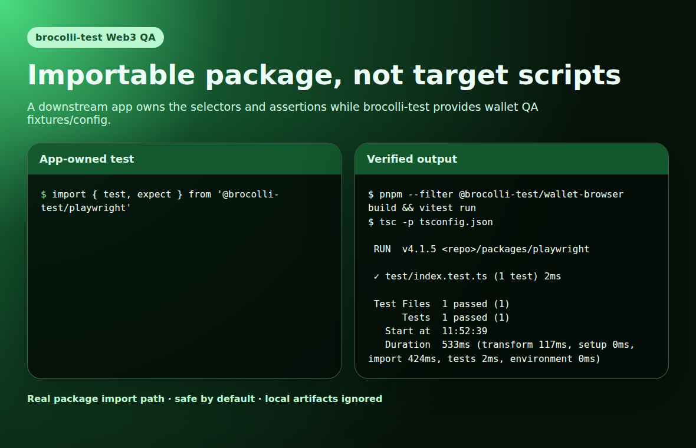

# brocolli-test

Web3 QA automation for real browser-wallet flows.

brocolli-test is an importable Playwright wallet QA foundation for testing dapps through a real wallet extension instead of a mocked provider. It layers reusable Playwright fixtures over the lower-level wallet-browser helpers, keeps wallet side effects opt-in, drives dapp UI, handles wallet prompts through fail-closed guardrails, and writes redacted proof artifacts that can be verified after a run.

The project focus is now narrow and product-oriented:

> Help dapp teams and agent builders run repeatable, safe QA checks for wallet connection, chain switching, signature prompts, transaction prompts, and dapp state using the same browser-wallet path a user would use.

## Why this exists

Most Web3 QA either mocks `window.ethereum` or relies on manual wallet testing. That misses the failure modes users actually hit:

- broken wallet connect modals;
- stale or hidden MetaMask popups;
- wrong-chain flows;
- account mismatch bugs;
- signature and transaction prompts that ask for more than expected;
- dapp UI that says connected while provider state disagrees.

This repo is building a safer middle layer: real browser, real wallet extension, real dapp, explicit policy, auditable proof.

## Product pillars

1. **Real wallet runtime**  
   Persistent Chromium context + pinned MetaMask extension + isolated burner/testnet profile.

2. **Dapp QA flows**  
   Reusable checks for connect, chain/account assertion, prompt classification, signature rejection/approval, and transaction guardrails.

3. **Policy before clicks**  
   Every wallet action is bounded by expected origin, chain, account, prompt type, target, and value.

4. **Proof artifacts**  
   Runs produce local-only screenshots, manifests, hashes, and redacted diagnostics. Verifiers reject wrong chains, wrong origins, missing screenshots, path leaks, and full-address leaks.

5. **App-owned interface**  
   Dapp teams import the Playwright fixtures in their own tests; repo scripts stay limited to local utilities such as fetching MetaMask and running safety checks.

## Current status

Working today:

- TypeScript/pnpm workspace with importable packages only.
- `@brocolli-test/playwright` fixtures for downstream app QA suites.
- `@brocolli-test/wallet-browser` core config, network, prompt, guardrail, proof, and MetaMask helpers.
- MetaMask extension fetcher for ignored local extension artifacts.
- Persistent Chromium + MetaMask smoke utilities.
- Redacted proof verification for connection artifacts.
- Sensitive-content scan for tracked files and git history patches.

Downstream fixture apps now live outside this repo:

- `BROCCOLO1D/broccoli-control` is the official public local fixture dapp.
- The local `BROCCOLO1D/wildcat-app-v2` fork imports `@brocolli-test/playwright` for app-owned wallet QA specs.

Local dogfood already proved:

- Chromium can load real MetaMask under Xvfb.
- A Sepolia burner wallet can be imported from ignored `.env`.
- A fixture dapp can connect to MetaMask on Sepolia and produce verified proof.
- Downstream apps can import the package from local tarballs while npm publishing is being prepared.

## Repository layout

```text
packages/playwright/                # Importable @brocolli-test/playwright fixtures for app QA suites
packages/wallet-browser/           # Core config, network, prompt, guardrail, proof helpers
scripts/fetch-metamask-extension.py # Local-only MetaMask extension fetch utility
scripts/sensitive-scan.py          # Public-repo secret/sensitive-content scan
docs/assets/readme/                # Reviewed README screenshots
docs/product-roadmap.md            # Product direction and buildout plan
docs/security-and-artifacts.md     # Safety policy for secrets, profiles, traces, screenshots
```

Ignored local runtime directories:

```text
.env
.wallet-extensions/
.wallet-profiles/
.wallet-artifacts/
playwright-report/
test-results/
traces/
```

## Quickstart

Install and verify the committed code:

```bash
pnpm install --frozen-lockfile
pnpm test
pnpm typecheck
pnpm build
pnpm security:scan
```

Fetch the pinned MetaMask extension locally:

```bash
pnpm wallet:metamask:fetch --dry-run
pnpm wallet:metamask:fetch
```

Run non-secret smoke/config commands:

```bash
pnpm --filter @brocolli-test/wallet-browser cli --help
pnpm --filter @brocolli-test/wallet-browser cli prepare
pnpm wallet:smoke:metamask
pnpm wallet:smoke:fixture-extension
```

On Linux/WSL/CI without a display, wrap real browser commands with Xvfb:

```bash
xvfb-run -a pnpm wallet:smoke:metamask
```

## Importable Playwright package



App QA suites can import the fixture foundation instead of shelling out to repo scripts:

```ts
// tests/wallet.spec.ts
import { expect, test } from '@brocolli-test/playwright';

test('connects with an explicit wallet policy', async ({ page, wallet, walletArtifacts }) => {
  await page.goto('http://127.0.0.1:5173');
  await wallet.connect({
    requestConnection: async () => page.getByRole('button', { name: /connect/i }).click(),
    expectedAccount: '0x0000000000000000000000000000000000000000',
    expectedChainId: 11155111,
    origin: 'http://127.0.0.1:5173'
  });
  await walletArtifacts.screenshot('connected');
  expect(wallet.maskAddress('0x0000000000000000000000000000000000000000')).toContain('…');
});
```

Real MetaMask launch is opt-in via `walletConfig.useRealWallet`; without explicit prompt/network drivers, wallet actions fail closed rather than pretending approval succeeded.

```ts
// playwright.config.ts
import { defineWalletQaConfig } from '@brocolli-test/playwright';

export default defineWalletQaConfig({
  use: {
    walletConfig: {
      useRealWallet: false,
      artifactDir: '.wallet-artifacts/playwright'
    }
  }
});
```

## Local live QA runs

Create a local burner/testnet config:

```bash
cp .env.example .env
chmod 600 .env
```

Fill only burner/testnet values. Never use production wallets.

Run fixture-app QA from a downstream app that imports this package. The official fixture app is `BROCCOLO1D/broccoli-control`:

```bash
cd ../broccoli-control
npm run dev
npm run test:wallet
```

For real wallet flows, use ignored burner/testnet config and keep screenshots, traces, wallet profiles, and manifests local unless they have been reviewed and scrubbed for public docs.

## Safety posture

- Burner/testnet wallets only.
- Fail closed on unexpected origin, chain, account, prompt type, target, or value.
- Default transaction value cap is zero wei.
- Refuse unknown signing or transaction prompts unless a specific policy allows them.
- Treat wallet profiles, traces, screenshots, and videos as sensitive.
- Never commit `.env`, wallet profiles, extension bundles, traces, reports, or local proof artifacts.
- Redact private keys, seed phrases, wallet passwords, RPC tokens, full `.env` contents, sensitive local paths, and full wallet addresses from public logs/docs.

## Product buildout path

See [docs/product-roadmap.md](docs/product-roadmap.md) for the focused progression. The next milestone is to publish the packages and keep expanding reusable wallet QA fixtures consumed by `broccoli-control`, the Wildcat fork, and future app-owned dapp QA suites.

## Docs

- [Product roadmap](docs/product-roadmap.md)
- [Security and artifact handling](docs/security-and-artifacts.md)
